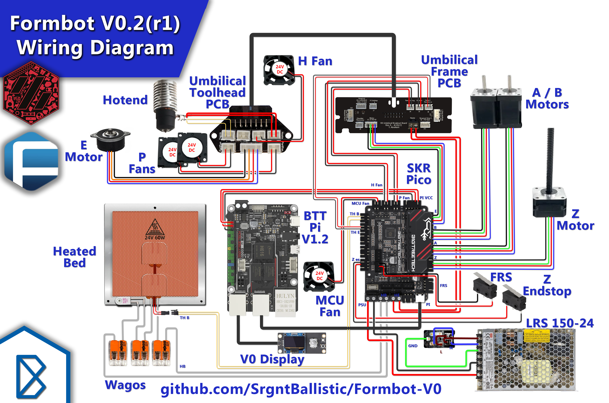

# Formbot-V0

Details/Documentation for the Formbot V0 Kit

Check out my full build stream series here:
<https://www.youtube.com/playlist?list=PLwWNdxHVFVf1DbI2nGngUB0O9TWeXn2Sx>

## Features

- Kirigami Bed Frame
- BTT Pi V1.2
- BTT SKR Pico
- BTT V0 Display
- CHC V6 Hotend (Upgradeable to Dragon/HF)
- Double Sided PEI Sheet
- Crimped Wiring Looms
- Moons Motors
- Stainless Steel Rails
- MIC6 Cast Aluminum Build Plate
- Polycarbonate Panels
- Gates Belts
- Vivedino 60W Silicone Bed Heater
- Stainless Steel Hardware
- Umbilical Board + Harness
- Makerbeam XL Extrusion
- Meanwell 150W PSU

Aliexpress Listing: <https://s.click.aliexpress.com/e/_Dk19GYN>

## Helpful info

Most of this is set in the `printer.cfg` file I've provided:
<https://github.com/SrgntBallistic/Formbot-V0/blob/v0.2/Firmware/bigtreetech-skr-pico-v1.0.cfg>

### Motor Models

Helpful for the Autotune TMC Klipper Plugin

- A/B - MS14HS5P4150-11
- z - LE174S-T0808-200-0-S-065
- E - CSE14HRA1L410A-01

### Max Motor Currents

- A/B - 1.5A
- Z - 0.65A
- E - 1.0A

See <Images/Motors> folder for Motor drawings with current ratings.

### 65% Run Currents

Voron recommends 60-70% (0.6-0.7) to start
I chose 65%. Increase as needed but try to stay below 80-90%

Run Current = rated_motor_current * 0.707 * 0.65

Plug the max currents above into the equation with your desired percentage

- A/B - 0.69 (NICE!)
- Z - 0.3A
- E - 0.46A

### Thermistors

- Formbot Bed - "Generic 3950"
- Formbot V6 CHC Hotend - "ATC Semitec 104NT-4-R025H42G"
- Check Klipper docs for the correct sensor type based on your thermistor/hotend

## Kirigami Bed

GitHub: <https://github.com/christophmuellerorg/voron_0_kirigami_bed>

Manual: <https://github.com/Kagee/kirigami-bed-manual>

LDO Kirigami Docs: <https://www.ldomotion.com/p/guide/18295873486461670>

The Formbot kit only comes with the Kirigami Frame. There's no LED/PCBs/Wago connectors, etc... included with the kit. You can source these yourself, find a partial wiring kit that includes them, or just leave them out and hard wire the bed components. See my My Mods section for the kit I bought.

The Kirigami bed frame is a great mod/upgarde that comes with the kit. It replaces multipe extrusions and printed pieces with a single rigid bed frame. The LDO Docs and Kirigami manual by Kagee provide some great info on general installation of the bed.

I had some trouble with the provided bed. I was able to get through all the issues with small DIY fixes. Other people have also noted they've run into these issues on the Voron Discord as well as the Kirigami GitHub. YMMV

- Frame Thickness
  - My frame measured about 2.3-2.5mm
    - I think this is due to the thickness of the paint on the frame
  - Spec is 2mm, max tolerance of 0.2mm
  - Caused the frame to not fit the printed Kirigami "stealth" Parts
    - Stealth Nut Block
    - Steath Chain Mount
    - Can file the gaps in these parts or modify them in CAD and reprint if they don't fit
    - Can also use some of the legacy non stealth parts

GitHub Issue: <https://github.com/christophmuellerorg/voron_0_kirigami_bed/issues/16>

- Frame holes
  - Again likely due to the thickness of the paint
  - Caused some slight over constraining of the frame when attached to the Z carriages
  - My mounting screws barely fit through the holes
  - No wiggle room to allow the frame and carriages to self align in a well enough that the frame and carriages would fall under their own weight
    - Didn't completely bind the frame movement
    - Just wasn't as smooth/free as after fixing
  - Compounded with the frame not fitting in the nut block well
  - Solved by filing out the holes in the frame
    - This reduced the constaining and allowed the bed to fall easily

Non Stealth (Left) and Filed Stealth Nutblock (Right)

- Thermal Fuse Location
  - When I went to adjust the bed screws so they bed was just close enough to the nozzle I couldn't get the bed springs to compress enough
  - The thermal fuse was running into the frame
  - I could have reduced the Max Z so the bed wouldn't come up as high after homing
  - But didn't want to lose any Z height
  - Solved by filing away a tiny bit of material on the frame where the fuse was interferring

There are mounting slots in the Kirigami frame that allows forward/backward movement of the bed screws. The LDO Docs include a link to a set of spacers that allow locking the heated bed in the forwardmost or rear most position.

Position these such that the nozzle is able to reach the full extent of the front and back of the bed. For me that was with the bed towards the rear.

## BTT SKR Pico

GitHub: <https://github.com/bigtreetech/SKR-Pico>

Manual: <https://github.com/bigtreetech/SKR-Pico/blob/master/BTT%20SKR%20Pico%20V1.0%20Instruction%20Manual.pdf>

**Flashing (From Pi without PC)**: <https://docs.vorondesign.com/build/software/skrPico_klipper.html>

The SKR Pico is a nice small footprint Main Board. It trades some IO/connectivity capability for its compact size. Ex: there's no input of the chamber thermistor that comes on the V0 Umbilical frame PCB. Also there's no extra fan ports to hook up fans for something like the Nevermore filter. An Extra MCU like the Klipper Expander would be necessary to get some of this IO back.

### SKR Pico Compile Params

There's some new compile params for the RP2040 in Klipper MenuConfig. Here's what worked for me

- MCU: Raspberry Pi RP2040
- Bootloader Offset: No bootloader (for USB, 16Kib for Canbus)
- Flash chip: W25Q080 with CLKDIV 2
- Communication interface (USB)
- USB IDs: USB Serial number from CHIPID
- GPIO pins: Empty

## BTT V0 Display

GitHub: <https://github.com/VoronDesign/Voron-Hardware/tree/master/V0_Display>

Flashing Docs: <https://github.com/VoronDesign/Voron-Hardware/blob/master/V0_Display/Documentation/Setup_and_Flashing_Guide.md>

Biqu Listing: <https://biqu.equipment/products/voron-display-v1-0>

Ali Express Listing: <https://s.click.aliexpress.com/e/_DBvhC7R>

Features:

- 1.3" OLED Display
- Rotary Encoder
- Neopixel
- STM32F042F6P6 MCU
- USB Connector

Small simple display with a neopixel onboard to change the LCD Color.

## BTT Pi V1.2

GitHub: <https://github.com/bigtreetech/BTT-Pi>

Manual: <https://github.com/bigtreetech/BTT-Pi/blob/master/BIGTREETECH%20Pi%20V1.2%20User%20Manual.pdf>

Biqu Listing: <https://biqu.equipment/collections/control-board/products/bigtreetech-btt-pi-v1-2>

Aliexpress Listing: <https://s.click.aliexpress.com/e/_DmQwZ0V>

Useful features:

- ADXL SPI Port for Input Shaping
- 12-24V Power terminal input
- 5V USB-C Power input

The BTT Pi V1.2 is a nice alternative to Raspberry branded Single-Board-Computers that have frequently shot up in price. It has some nice 3D Printing specific features and numerous ways to power it.

### Flashing Image

The BTT Pi uses the same images as the BBT CB1 compute module. You can follow instructions for installing it.

BTT has 2 versions of the Kernal. A Minimal image and a Klipper image. The Klipper image has Klipper, Mainsail, Crowsnest and most other dependencies pre-installed. They just need to be updated after.
Images: <https://github.com/bigtreetech/CB1/releases>

By Default the host name for the image will be "btt-cb1" and it can be accessed with "btt-cb1.local" if you don't know the IP Address for it yet.

## V0 Umbilical

GitHub: GitHub: <https://github.com/VoronDesign/Voron-Hardware/tree/master/V0-Umbilical>

The V0 Umbilical is a great mod included in this kit. It makes wiring much easier. All of the signals/power to the toolhead goes through a toolhead PCB breakout board, down to the back of the frame via a pre-made wire harness, through a second frame pcb breakout board and finally down to the SKR Pico.

Forbmot has precut and crimped most of the wires that go from the mainboard to the frame PCB. They've also made most of the wires that hook into the toolhead pCB the correct length as well.

Be sure to print the V0 Toolhead PCB mount and strain relief found here:
<https://github.com/VoronDesign/Voron-Hardware/tree/master/V0-Umbilical/STLs/V0.2>

## Wiring

### General Wiring

This is a general wiring diagram for a Formbot V0.2(r1) kit. The only thing specific to the `V0.2r1` is the Filament Runout Sensor (FRS) which gets plugged into the `E0 Endstop` input on the SKR Pico (next to the RGB/Neopixel). Otherwise it should serve pretty well as a general `V0.2` build.

Since the `V0.2` uses sensorless homing on the X-Y/A-B axes there's no endstops plugged into either of those inputs. In fact it's important to ensure that nothing is plugged into these inputs. Otherwise sensorless homing will not work.

### Kirigami Bed Wiring

The Kirigami Bed Frame alows splitting the wiring coming out of the bed so that the bed can be removed and worked on without being tethered to the printer.

Voron recommends using Wago connectors to allow easily disconnecting the wires. The Kirigami bed mod includes mounts for the Wago connectors.

Since the Formbot kit bed heater doesn't include an integrated thermal fuse it needs to be connected inline with one side of the bed wires.

### Generic Formbot Wiring

An inline connector can be used to split the Thermistor wires under the bed.

### Formbot Wiring + LDO Kirigami Wiring Kit

The LDO wiring kit includes 2 Wago mounts, a Thermistor breakout PCB and an LED PCB. A third wago is needed for the Formbot Thermal Fuse. The LDO V0 repo has stls for mounting its PCBs and the wagos. See the Kirigami Manual for more info.

### BTT Pi Power

Formbot provides a precut, pre-crimped wire harness to go from the BTT SKR Pico's top right pins over to the BTT Pi V1.2's VCC and GND GPIO Pins. It provides 2 5V wires and a single ground. I think these were design to work with an original Raspberry Pi 3/4 which has it's GPIO on the right.

Since the BTT Pi has it's GPIO on the left the only way to get the wires over to those pins I had to stretch them across both boards. I felt the looked bad and worried about the tension.

To solve this I used their JST connector and repinned/crimped the some longer wires with Dupont connectors on the opposite side. With the wires longer I can pas them under the edges of the boards and through the cable management channel in the middle

## Products Used

### Phaetus Dragon HF

This is an optional upgrade on some Formbot listings. It offers single hand nozzle tightening and much higher Max Flow Rate compared to the default Formbot V6 CHC nozzle.

### Bondtech 0.4 CHT Nozzle

This further increases the flow rate of the Dragon HF.

### Fabreeko cPIF V0.2 Printed Parts

<https://www.fabreeko.com/collections/v0/products/voron-v0-2-s1-printed-parts-by-pif?variant=43678271570175>

I found the cPIF parts pretty nice. I've since replaced a couple of of failed parts but I don't attribute the failures to the quality of the prints. More to some inherent issues in the part design

### EP2 Grease

<https://www.fabreeko.com/collections/v0/products/mobilux-ep2-grease>

I originally greased the rails with White Lithium lubricant but bought this and regreased them when I redid the frame.

### GDS Time Fan Mini Stealthburner Fan Kit

<https://dfh.fm/products/voron-mini-stealthburner-fan-kit?_pos=7&_sid=66ce4f1ac&_ss=r>

The stock fans are probably the most noticable lower quality parts of this kit. I found the plastic a bit brittle and the leads didn't tuck into the their slots on the body. This cause them to get pinched when I put them in the Mini SB.

### RC Style Hex Drivers

I found using any type of ball end and some not very sharp edged hex/allen drivers or bits resulted in stripped screws. In particular on the Frame and rails screws which I ended up screwing and unscrewing numerous times.

I tried my RC style hex drivers which have noticably sharper corners and noticed I didn't have any stripped screws.

Most will probably work well. Fabreek sells a couple different sets

Link: <https://www.fabreeko.com/products/fabreeko-precision-screw-driver-set-of-5?variant=38183379828934>

### Flexible "Drone" USB Cable

This low profile USB cable was usefult to connect the Klipper Expander board to the BTT Pi V1.2.

Link: <https://github.com/andrewmcgr/klipper_tmc_autotune>

## My Mods

### LDO Kirigami Wiring Kit

**Description**: "LDO Krirgami LED PCB, LDO Kirigami Breakout PCB, LDO Breakout Wire Kit, Wago 221-412 x 2 For use with Kirigami Beds"

**Link**: <https://dfh.fm/products/voron-v0-kirigami-bed-wiring-and-led-kit>

Since the Formbot Kit only comes with the frame I bought this wiring kit to get close to what comes in the LDO kit.

### Nevermore V6

**Description**: 3D Printed Activated Charcoal Filter

**Link**: <https://github.com/nevermore3d/Nevermore_Micro/tree/master/V6>

2 5015 Fans

- Fabreeko - <https://www.fabreeko.com/products/5015-blower-fan-by-honeybadger?_pos=1&_psq=50151&_ss=e&_v=1.0&variant=43628023152895>
- DFH - <https://dfh.fm/products/5015-24v-dual-ball-blower?_pos=1&_sid=426120d23&_ss=r>

2 Wago 221-412 connectors (Optional)

- Activated Charcoal Pellets - <https://www.fabreeko.com/products/nevermore-carbon?_pos=1&_sid=6691ede3b&_ss=r&variant=43205733449983>

Printing ABS (as with most filament materials) can release VOCs (Volatile Organic Compounds) and has a noticabley more noxious smell than other materials like PLA. An active carbon filter can help clear absorb those orders/VOCs and move some air around the chamber for more efficient heating.

### Klipper Expander Board

Board allows increased IO and power for mods and upgrades limited by BTT SKR Pico board

- Neopixels
- Nevermore Fans
- Chamber Thermistor

**Links**:

- Fabreeko - <https://www.fabreeko.com/collections/v0/products/klipper-expander-board>
- DFH - <https://dfh.fm/products/klipper-expander-for-voron-3d-printers?_pos=1&_sid=9323da715&_ss=r>

### Fabreeko Honeybadger V0 Metal Toolhead Carriage

**Link**: <https://www.fabreeko.com/collections/v0/products/v0-2-metal-toolhead-carriage-for-v0-2-by-honeybadger?variant=44164192338175>

**Variation**: MGN7H

Requires - 4 M2x4 screws (for carriage mount), M3x8 (replaces rear M3x16 motor plate screw)

One of the parts I noticed failing was the X carriage. The hex nuts place on the front of the carriage started spinning in their slots. There was also a couple layer splits in the part when I removed it.

### Rainbow Matchstick LEDs

**Links**:

- DFH - <https://dfh.fm/products/rainbow-stick?variant=43340753666270>
- KB3D - <https://west3d.com/products/rainbow-on-a-matchstick?_pos=10&_sid=57e17111c&_ss=r>

**Mounts**: <https://www.printables.com/model/408214-matchstick-diffusers>

Becuase RGB LEDs

### Rainbow Barf LED Skirts

**Links**:

- Model By Maple Leaf Makers - <https://www.printables.com/model/408741-v0-rgb-skirt-logo>
- Fabreeko - <https://www.fabreeko.com/products/rainbow-leds-pcb-by-whoppingpochard?_pos=1&_sid=cb992e68d&_ss=r>
- <https://west3d.com/products/steathburner-led-upgrade-rgbw?_pos=1&_sid=57e17111c&_ss=r>

### Cable Management Tracks

These are printable versions of the tracks that LDO and other kits include.
I recomend printing them in PETG or a similar material that can flex a bit before snapping. I tried printing them in sever ABSs including Fusion Deep Water blue and the guide fingers were very brittle.

**Voron User Mod Link**: <https://mods.vorondesign.com/detail/YTmSPTcWpctfTKQj3bOPg>

### Oriber Smart Filament Runout Sensor

**Project Link**: <https://www.orbiterprojects.com/orbiter-filament-sensor/>

I thought it would be fun to modify the stock V0.2r1 FRS foot and use a smart sensor instead. With the use of a ball bearing and 2 push buttons the Orbiter sensor takes advantage of Klipper Macros to allow features like pausing/resuming, auto extruder heating, auto purging and quick unloading with the press of a button.

I'll upload the files and/or modifications when I feel it's in a good place.

### V0 Hinged Spool holder and Rear Panel

**Mod Link**: <https://www.printables.com/model/548771-voron-0-hinged-back-panel-w-hinged-filament-spool->

I found that I was frequently taking off the rear panel and often had to lay the printer on its back. This combo of mods makes it easy to work on the electronics of the printer and move it around without undoing a lot of screws.

## Tuning

To tune the printer I used a combination of:

- The Klipper Config Checks: <https://www.klipper3d.org/Config_checks.html>
- Voron Guide Startup Checks: <https://docs.vorondesign.com/build/startup/>
- Andrew Ellis' Tuning guide: <https://ellis3dp.com/Print-Tuning-Guide/>
- OrcaSlicer's Calibration Prints/Tools: <https://github.com/SoftFever/OrcaSlicer/wiki/Calibration>
- CNC Kitchen Max Volumetric Flow Rate Test: <>

Things to tune

- Extruder Rotation Distance (Ellis)
- Build surface prep (Ellis)
- First slayer Squish (Ellis)
- Pressure Advance (Ellis/OrcaSlicer)
- Tuned EM/Flow-Ratio for the main filaments I use (Ellis/OrcaSlicer)
  - Polymaker ABS/ASA
  - MH Build PLA
  - MH Build ABS
  - Fusion Heavy water Blue
- Retraction (Ellis/Orca)
- Max Volumetric Flow Rate (Ellis/OrcaSlicer/CNC Kitchen)
- Motor Currents (Ellis)
- Input shaper (Klipper Docs)
  - Axes Ressonance
  - Belt Tension
